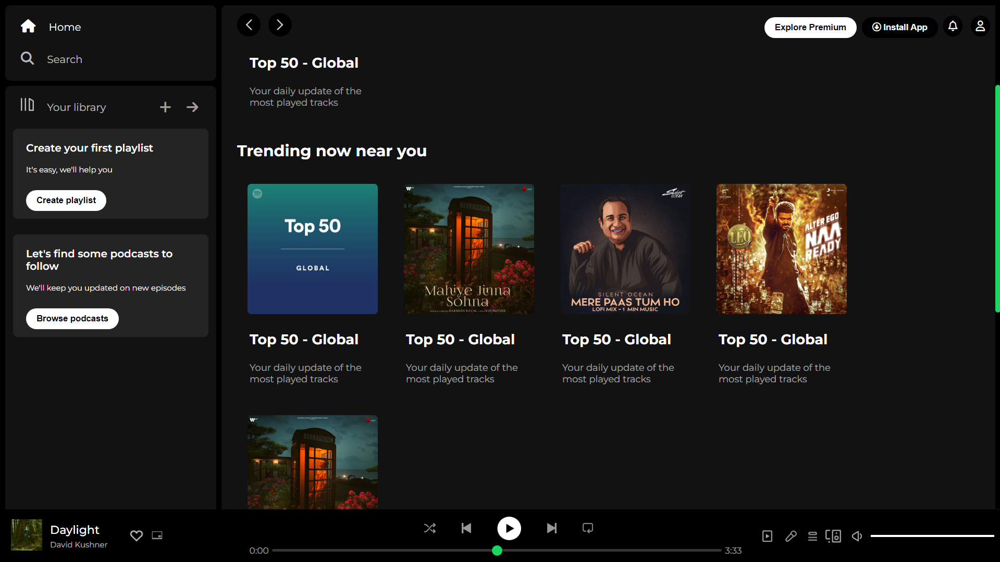

# Spotify Clone

This is a Spotify clone made using HTML5 and CSS. 

## Table of contents

- [Overview](#overview)
  - [Screenshot](#screenshot)
  - [Links](#links)
- [My process](#my-process)
  - [Built with](#built-with)
  - [What I learned](#what-i-learned)
  - [Continued development](#continued-development)
  - [Useful resources](#useful-resources)
- [Author](#author)
- [Acknowledgments](#acknowledgments)

## Overview

### Screenshot

### Links

- Live Site URL: [Add live site URL here](https://priyanshu-prime.github.io/Spotify-Clone/)

## My process

### Built with

- Semantic HTML5 markup
- CSS custom properties
- Flexbox
- CSS Grid

### What I learned

I learnt how the different elements of a webpage are combined and organized to make it more presentable, accessible and easy to use. Different interactive elements and their design is what I understood greatly about.

## Author

- Website - [Priyanshu Makwana](https://www.your-site.com)
- Instagram - [@priyanshu_prime](https://www.twitter.com/yourusername)